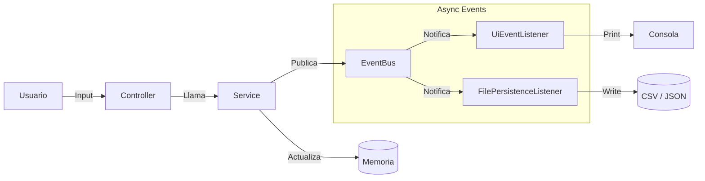

# ⚽ Soccer Manager (Layered Architecture Project)

Este proyecto es una aplicación de gestión de equipos de fútbol desarrollada en **Java puro (sin frameworks externos)**. Su objetivo principal es demostrar la implementación de una **Arquitectura en Capas (Layered Architecture)** robusta, combinada con un patrón de diseño orientado a eventos (**Event-Driven**) para desacoplar la lógica de negocio de los efectos secundarios (persistencia y notificaciones UI).

-----

## 🚀 Características Principales

* **Gestión de Equipos:** Crear, consultar y eliminar equipos con validaciones de negocio.
* **Gestión de Jugadores:** Fichar y despedir jugadores, controlando dorsales únicos y reglas de negocio.
* **Simulador de Partidos:** Motor de simulación probabilístico basado en la plantilla de jugadores.
* **Persistencia Híbrida:**
    * **En Memoria:** Uso de colecciones concurrentes (`ConcurrentHashMap`) para alto rendimiento.
    * **En Disco:** Persistencia automática en formatos **CSV** y **JSON**.
* **Sistema de Eventos Asíncrono:** Bus de eventos propio para manejar feedback en consola y guardado en disco sin bloquear el hilo principal.

-----

## 🏗️ Arquitectura del Sistema

El proyecto sigue una estricta separación de responsabilidades:

1.  **Capa de Presentación (UI):** (`ui`)
    * Maneja la interacción con el usuario a través de la consola.
    * **Componentes:** `ConsoleMenu`, `AppController`.
2.  **Capa de Aplicación (Service):** (`service`)
    * Orquesta los flujos de trabajo y aplica reglas de negocio.
    * **Componentes:** `TeamServiceImpl`, `PlayerServiceImpl`.
3.  **Capa de Dominio (Model & Events):** (`model`, `events`, `domain`)
    * Contiene las entidades (`Team`, `Player`) y los eventos del dominio (`TeamCreatedEvent`, etc.).
    * Define las excepciones de negocio (`DomainException`).
4.  **Capa de Infraestructura (Persistence & Repository):** (`repository`, `persistence`)
    * Implementa el almacenamiento de datos.
    * **Componentes:** `InMemoryTeamRepository` (Memoria), `SnapshotSerializer` (Archivos).

### 🔄 Diagrama de Flujo de Datos (Event Bus)



-----

## 📂 Estructura del Proyecto

```text
src/
├── domain/           # Excepciones y Enums de errores (Rules)
├── events/           # Definición de Eventos de Dominio
│   └── bus/          # Implementación del EventBus y Listeners
├── model/            # Entidades: Team y Player
├── persistence/      # Serialización CSV/JSON y Listener de guardado
├── repository/       # Interfaces e implementación en memoria
├── service/          # Lógica de negocio (Interfaces e Impl)
├── ui/               # Menú de consola y controladores
├── util/             # Utilidades (Generador de UUIDs)
└── Main.java         # Punto de entrada y configuración de dependencias
```

-----

## 🛠️ Requisitos e Instalación

### Requisitos Previos

* **Java JDK 17** o superior.
* Cualquier IDE (IntelliJ IDEA, Eclipse, VS Code).

### Pasos para Ejecutar

1.  **Clonar el repositorio:**
    ```bash
    git clone <url-del-repositorio>
    ```
2.  **Estructura de Datos:**
    Asegúrate de que existe la carpeta `data/` en la raíz del proyecto. El sistema buscará `teams.csv` y `players.csv` para la carga inicial.
3.  **Compilar y Correr:**
    Ejecuta la clase `src/Main.java`.

-----

## 💾 Persistencia y Datos

El sistema utiliza una estrategia de persistencia robusta y tolerante a fallos:

* **Carga Inicial:** Intenta cargar desde archivos JSON (`.json`). Si no existen o fallan, hace "fallback" a los archivos CSV (`.csv`).
* **Guardado Atómico:**
    * Los cambios se detectan mediante eventos (`TeamCreated`, `PlayerAdded`, etc.).
    * `FilePersistenceListener` agrupa los cambios (debounce de 300ms) para evitar escrituras excesivas.
    * `SnapshotSerializer` escribe primero en un archivo temporal (`.tmp`) y luego realiza un movimiento atómico para reemplazar el archivo real, evitando corrupción de datos.

-----

## 🎮 Guía de Uso

### 1\. Crear Equipo

Permite registrar un nuevo club definiendo nombre, ciudad, entrenador y formación.

### 2\. Añadir Jugador

Permite fichar jugadores para un equipo existente.

> **Nota:** El sistema valida que el dorsal (0-100) no esté repetido dentro del mismo equipo.

### 8\. Mostrar Resumen

Muestra una vista rápida de todos los equipos, cantidad de jugadores y partidos ganados.

### 9\. Simular Partido

Simula un encuentro entre dos equipos basándose en sus plantillas:

* Se requiere que los equipos tengan jugadores.
* Cada jugador tiene una probabilidad del 50% de marcar gol en el partido.
* El sistema actualiza automáticamente las estadísticas de victorias y goles.

-----

## 🧩 Detalles Técnicos Destacados

1.  **Event Bus Personalizado:**
    Implementación propia de un Bus de Eventos usando `ExecutorService` y `ConcurrentHashMap` para manejar suscriptores. Permite que la UI siga respondiendo mientras se guarda en disco en segundo plano.

2.  **Inyección de Dependencias Manual:**
    En `Main.java`, las dependencias se inyectan manualmente (Constructor Injection), demostrando cómo funcionan los frameworks como Spring "por debajo".

3.  **Manejo de JSON Artesanal:**
    Incluye un parser y generador JSON simple (`JsonParser` inner class en `SnapshotSerializer`) escrito desde cero, sin librerías como Jackson o Gson.

-----

## 👥 Autor

Proyecto desarrollado como práctica de arquitectura de software en Java.